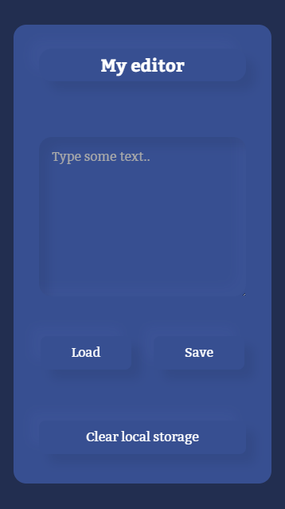

View this project live at [Github Pages.](https://jarek-janowski.github.io/simple-editor/)

# Simple editor

It's just simple local storage editor, you can add & load or clear data from local storage

## How to use it?

Just clone repository and run 'npm install'.
